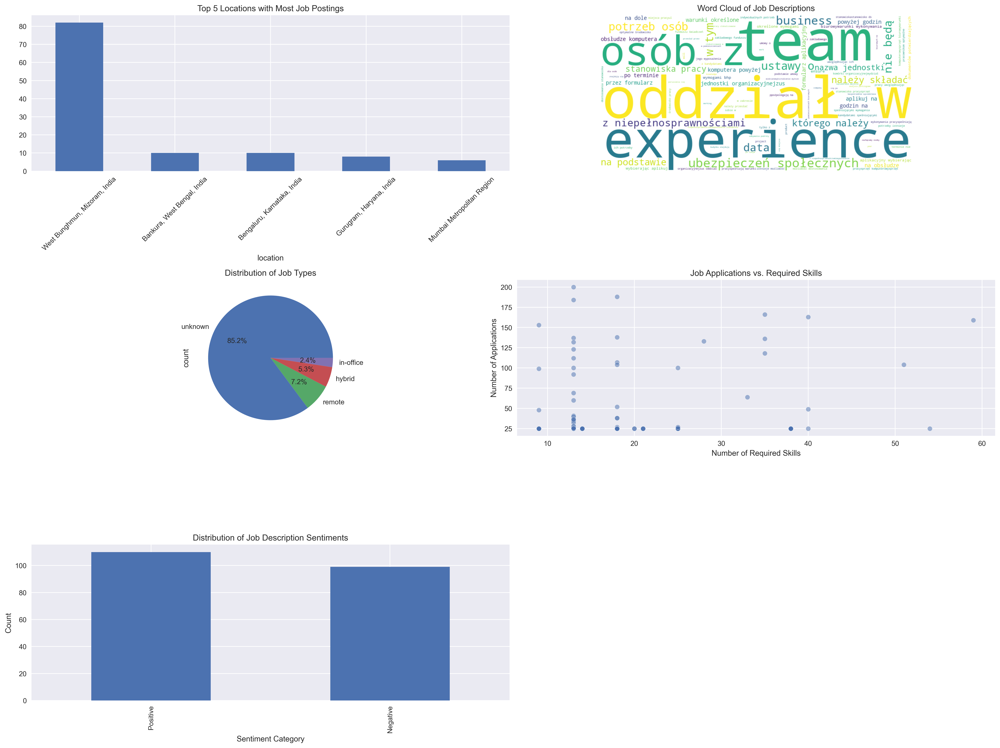
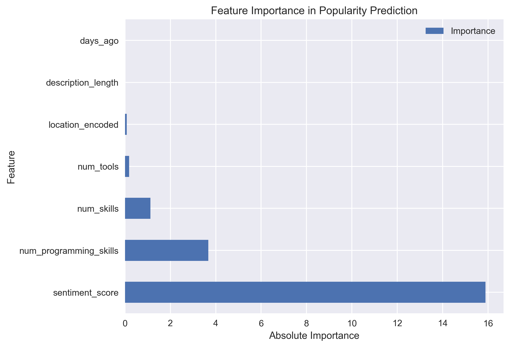

# Job Market Analysis Project

## Overview
This project aims to analyze job market trends by scraping job postings from LinkedIn, enriching the data with additional insights, and visualizing the results. The analysis includes location trends, job type distribution, sentiment analysis of job descriptions, and a predictive model for job popularity based on various features.

## Tools and Libraries Used
- **Python**: The primary programming language used for data scraping, cleaning, analysis, and visualization.
- **Pandas**: For data manipulation and analysis.
- **BeautifulSoup**: For web scraping and parsing HTML content.
- **Requests**: For making HTTP requests to fetch job postings.
- **NLTK**: For natural language processing tasks, including sentiment analysis.
- **Scikit-learn**: For building and evaluating machine learning models.
- **Matplotlib/Seaborn**: For data visualization.
- **WordCloud**: For generating word clouds from job descriptions.
- **Flask**: For creating a web application to display the analysis results.
- **Plotly**: For interactive visualizations in the Flask app.
- **APScheduler**: For scheduling periodic tasks like data scraping and analysis.

## Challenges Encountered and Solutions

### 1. **Data Scraping Challenges**
   - **Challenge**: LinkedIn's dynamic content and anti-scraping mechanisms made it difficult to consistently fetch job postings.
   - **Solution**: Implemented a robust scraping mechanism using BeautifulSoup and Requests, with error handling to manage failed requests and dynamic content. Additionally, pagination was handled to scrape multiple pages of job postings.

### 2. **Data Cleaning and Enrichment**
   - **Challenge**: The raw data contained inconsistencies, missing values, and unstructured text fields.
   - **Solution**: Applied text cleaning techniques to standardize job titles, descriptions, and requirements. Extracted key information such as programming languages, tools, and skills using keyword matching. Derived additional features like job posting age and work type (remote, hybrid, in-office).

### 3. **Sentiment Analysis**
   - **Challenge**: Sentiment analysis on job descriptions required handling a large volume of text data with varying tones and contexts.
   - **Solution**: Utilized NLTK's SentimentIntensityAnalyzer to compute sentiment scores and categorize job descriptions as positive, neutral, or negative. This provided insights into the overall sentiment of job postings.

### 4. **Model Performance**
   - **Challenge**: The initial predictive model for job popularity had low accuracy and poor generalization.
   - **Solution**: Feature engineering was performed to include relevant features like description length, number of skills, and sentiment score. The model was trained using Linear Regression, and feature importance analysis helped identify the most impactful features.

## Key Insights from the Data Analysis

### 1. **Location Trends**
   - The majority of job postings were concentrated in the United States, with specific hotspots in cities like Austin, TX, and San Antonio, TX.
   - **Insight**: Companies in tech hubs like Austin are actively hiring, indicating a strong demand for tech talent in these regions.

### 2. **Job Type Distribution**
   - The distribution of job types showed a significant number of remote and hybrid roles, reflecting the ongoing trend towards flexible work arrangements.
   - **Insight**: The shift towards remote work is evident, with many companies offering hybrid options to attract a broader talent pool.

### 3. **Sentiment Analysis**
   - Most job descriptions had a positive sentiment, highlighting the optimistic tone used by employers to attract candidates.
   - **Insight**: Positive sentiment in job descriptions may correlate with higher application rates, as candidates are more likely to apply to roles that are described in an encouraging manner.

### 4. **Job Popularity vs. Skills**
   - There was a weak correlation between the number of required skills and the number of applications, suggesting that job seekers may prioritize other factors like job title or company reputation over the number of skills required.
   - **Insight**: Employers may need to focus on highlighting unique aspects of their roles beyond just the technical requirements to attract more applicants.

### 5. **Feature Importance in Popularity Prediction**
   - The sentiment score was the most important feature in predicting job popularity, followed by the number of tools and programming skills required.
   - **Insight**: Job descriptions with a positive sentiment and clear technical requirements are more likely to attract applicants.

## Visualizations

### Job Market Analysis


### Feature Importance


## Flask/Django Project Files

### 1. **Flask Application (`app.py`)**
   - The Flask app serves as a dashboard to visualize the analysis results. It includes interactive charts for location trends, job type distribution, sentiment analysis, and skills vs. applications.
   - **Features**:
     - Interactive visualizations using Plotly.
     - Summary statistics displayed on the dashboard.
     - Real-time updates when new data is scraped and analyzed.

### 2. **Scheduler (`scheduler.py`)**
   - The scheduler automates the scraping and analysis process, running the tasks every Monday at 1 AM.
   - **Features**:
     - Periodic execution of the scraper and analysis scripts.
     - Logging of job execution times and status.

### 3. **Data Scraping and Cleaning (`scrap_and_clean.py`)**
   - This script handles the scraping of job postings from LinkedIn and the subsequent cleaning and enrichment of the data.
   - **Features**:
     - Scraping of job titles, descriptions, locations, and other relevant details.
     - Cleaning and preprocessing of text data.
     - Extraction of key information like programming languages, tools, and skills.

### 4. **Data Analysis (`analysis.py`)**
   - This script performs the analysis on the enriched dataset, including sentiment analysis, visualization, and predictive modeling.
   - **Features**:
     - Sentiment analysis using NLTK.
     - Visualization of key trends using Matplotlib and Seaborn.
     - Predictive modeling using Linear Regression.

### 5. **Requirements (`requirements.txt`)**
   - Lists all the Python libraries required to run the project.
   - **Libraries**:
     - Flask, Pandas, Plotly, APScheduler, BeautifulSoup, Requests, NLTK, Scikit-learn, and Statsmodels.

## How to Run the Project

### Prerequisites
- Python 3.x installed.
- Install the required libraries using `pip install -r requirements.txt`.

### Steps to Run the Project
1. **Clone the Repository**:
   ```bash
   git clone <repository_url>
   cd <repository_directory>
   ```

2. **Run the Scraping and Cleaning Script**:
   ```bash
   python scrap_and_clean.py
   ```

3. **Run the Analysis Script**:
   ```bash
   python analysis.py
   ```

4. **Run the Flask App**:
   ```bash
   python app.py
   ```

5. **Access the Dashboard**:
   Open your web browser and navigate to `http://localhost:5000` to view the interactive dashboard.

## Conclusion
This project provides a comprehensive analysis of job market trends, offering valuable insights for both job seekers and employers. The automated scraping and analysis pipeline, combined with an interactive Flask dashboard, makes it a powerful tool for understanding the dynamics of the job market. Future work could include expanding the dataset to include more job boards and enhancing the predictive model with more advanced machine learning techniques.
